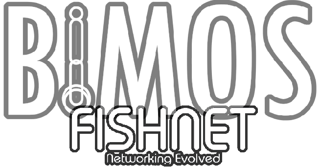

BIMOS Fishnet is a unity package for BIMOS which add multiplayer!

Networked BIMOS Rig was made with the mindset of inputs and can use either client side/server side movement

Important:
- You will need fishnet 3+ (turn on prediction if fishnet 4 for a better experience)
- You will need some updated scripts I commited from my BIMOS fork

Most Important:
- Have fun :D

Original Bimos Desc Down here by KadenZombie8!

BIMOS was my A-level computer science project. I created it to use in VR games that required realistic physical interaction like <a href="https://store.steampowered.com/app/823500/BONEWORKS/">BONEWORKS</a>.
 

# Links
- <a href="https://github.com/KadenZombie8/BIMOS/wiki">Wiki</a>
- <a href="https://discord.gg/Q3J2SJH4Xn">Discord server</a>
- <a href="https://kadenzombie8.itch.io/bimos-demo">Demo (itch.io)</a>
- <a href="https://sidequestvr.com/app/39281">Demo (SideQuest)</a>

# Gallery

# Features
## Multi-platform support
- PCVR
- Meta Quest
- WebXR
## Physics-based player controller
### Movement
- Smooth locomotion
- Teleport locomotion
- Running
- Jumping
- Crouching
### Animation
- Full body IK (using Animation Rigging)
- Procedural leg animation
- Hand pose system
- Custom hand pose editor
### Interaction
- Grabbing
- Button interactions with held objects
  - Trigger
  - Primary button
  - Secondary button
- UI interaction
  - Buttons
  - Sliders
## Tools
- Hand pose editor
- Spawn point system
- Sockets
- Attachers
## Sample assets
- Pistol
- Grapple gun
- Thruster
- Key
- Key door
- Axe
- Hammer
- Ladder
- Moving platform
- Pooey
- Target
- Ragdoll
- Pedestal button
- Reusable scripts to help with level design
# Limitations
- Custom avatars aren't implemented
- Hands can sometimes get stuck inside of objects as the grab system teleports the hands to align them with the grabs
- Body colliders are centred around the head (too far forward)
- Bound to 144 Hz physics rate (jump height varies when changed)
- Feet jitter on moving platforms
- No haptics
# Attribution
Under the MIT license, you are allowed to do whatever you want with BIMOS, even for commercial purposes. Attribution is not required, but if this project has helped you and you want to show gratitude then it would be nice to have "KadenZombie8" in the credits of your game(s)!
